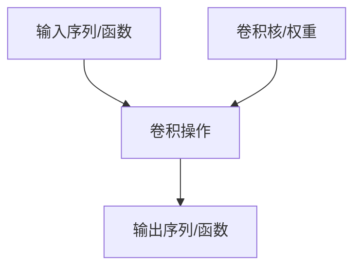

# 卷积：跨领域的数学魔术

## 核心概念解析


## 跨领域应用全景

### 1. 概率论：骰子游戏的数学法则

#### 非均匀骰子概率计算

- **传统方法**：36种组合穷举 → 效率低下

- **卷积解法**：

  ```python
  # 示例：计算两个骰子和的概率分布
  def dice_convolution(die1_probs, die2_probs):
      return np.convolve(die1_probs, die2_probs)
  ```

- **可视化技巧**：滑动窗口法 → 动态展示概率叠加过程

### 2. 图像处理：像素的魔法变形

#### 卷积核类型与效果

| 卷积核类型    | 矩阵示例                | 效果              | 数学本质 |
| :------------ | :---------------------- | :---------------- | :------- |
| 均值模糊      | [[1/9,1/9,1/9], ...]    | 平滑降噪          | 局部平均 |
| 高斯模糊      | 二维正态分布采样        | 自然过渡模糊      | 加权平均 |
| Sobel边缘检测 | [[-1,0,1], [-2,0,2]...] | 提取垂直/水平边缘 | 梯度计算 |

#### 实时处理演示


### 3. 多项式运算：隐藏的卷积本质

#### 乘法与卷积等价性

(2 x^2 + 3x + 1) ∗ (4x + 5) 展开过程：

1. 项间全连接 → 生成系数网格
2. 对角线求和 → 合并同类项
3. 结果：8 x^3 + 22 x^2 + 19x + 5

### 4. 计算革命：FFT加速秘籍

#### 算法性能对比

| 方法        | 时间复杂度 | 百万级数据耗时 |
| :---------- | :--------- | :------------- |
| 传统卷积    | O(n²)      | ~1.5小时       |
| FFT优化卷积 | O(n log n) | ~0.5秒         |

#### FFT实现步骤

1. 系数→频域（FFT变换）
2. 频域点乘
3. 逆变换回时域（iFFT）

------

## 深度洞见与延伸

### 连续概率分布：高斯之谜

- **中心极限定理**：独立事件和的分布趋于正态分布
- **卷积解释**：*f*∗*g* 刻画随机变量和的分布演化

### 数字乘法：隐藏的卷积

**123 × 456 计算过程**：

1. 每位相乘生成部分积网格
2. 对角线求和（含进位处理）
3. 结果：56,088

### 工程实践启示

1. **并行计算**：GPU加速矩阵运算
2. **核设计**：可学习卷积核（CNN核心）
3. **边界处理**：零填充 vs 有效卷积

> "卷积不是操作，而是一种观察世界的视角" —— 数学本质的哲学思考

【卷积的连续形式与微分方程应用，请见下篇】