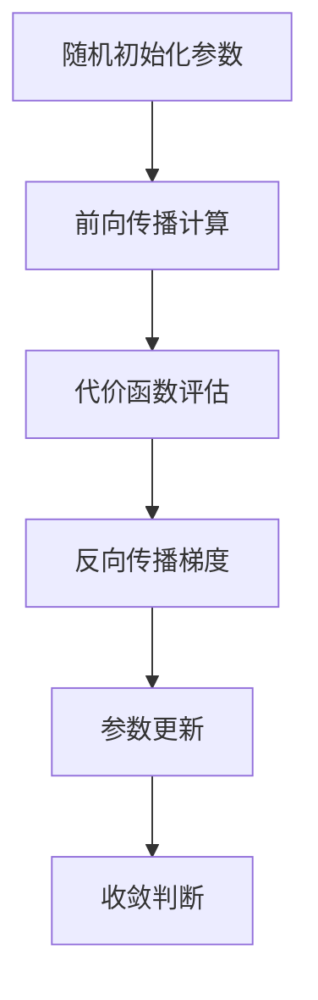
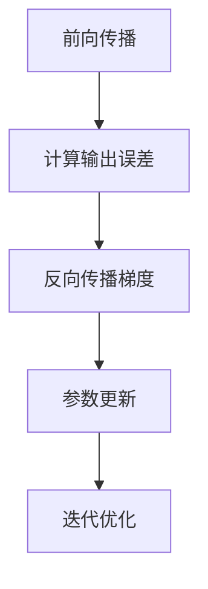
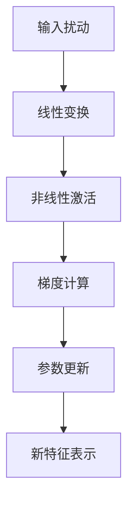
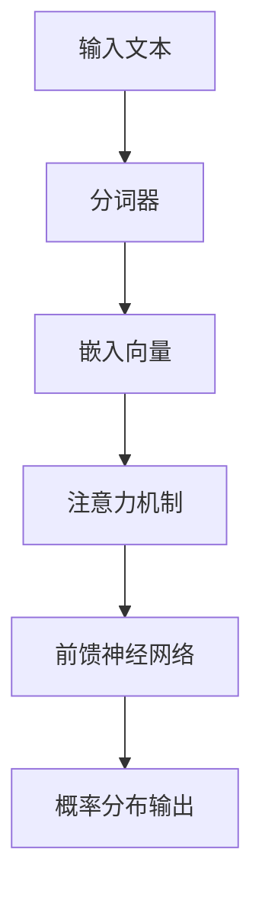
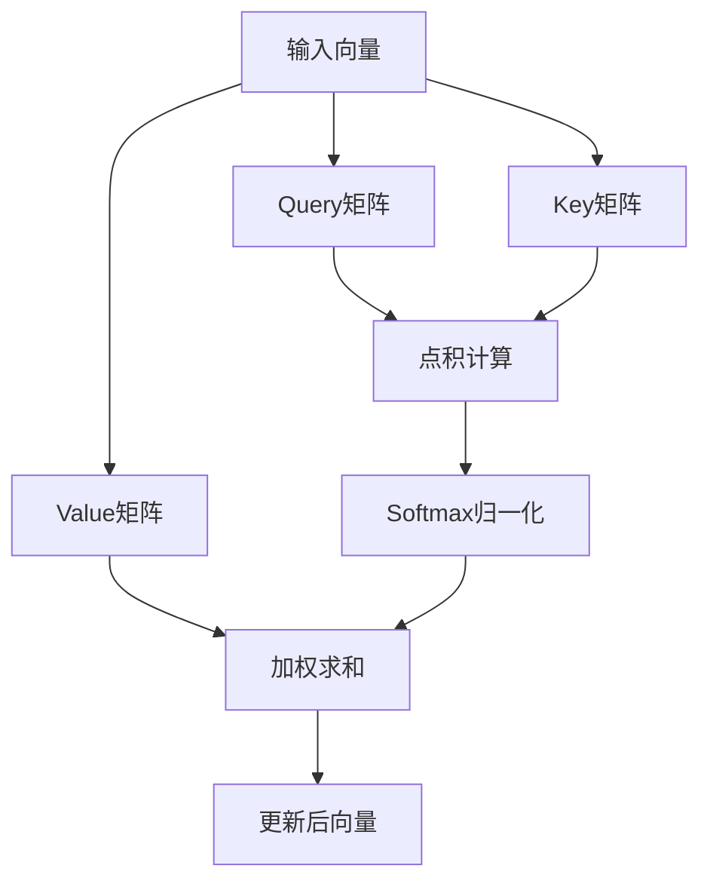

# 📚3Blue1Brown 深度学习课程笔记

# 【01】深度学习之神经网络结构解析

## 核心概念与生物学启示


### 关键特性对比

| 生物神经网络     | 人工神经网络       |
| :--------------- | :----------------- |
| 电化学信号传递   | 数值计算           |
| 突触连接强度可变 | 权重参数可调       |
| 全或无定律       | 激活函数非线性转换 |

------


## 经典全连接网络结构

### 层级架构解析

```python
# 网络结构参数示例
network = {
    "输入层": 784,    # 28x28像素图像
    "隐藏层1": 16,    # 特征抽象层
    "隐藏层2": 16,    # 高级模式识别层
    "输出层": 10      # 0-9数字分类
}
```

### 参数规模计算

| 连接层级          | 权重数量      | 偏置数量 | 总参数     |
| :---------------- | :------------ | :------- | :--------- |
| 输入层 → 隐藏层1  | 784×16=12,544 | 16       | 12,560     |
| 隐藏层1 → 隐藏层2 | 16×16=256     | 16       | 272        |
| 隐藏层2 → 输出层  | 16×10=160     | 10       | 170        |
| **总计**          | **12,960**    | **42**   | **13,002** |

------


## 数学原理深度拆解

### 单神经元计算模型

```math
a^{(l)}_j = \sigma\left( \sum_{k} w^{(l)}_{jk} a^{(l-1)}_k + b^{(l)}_j \right)
```

- *w*: 权重矩阵
- *b*: 偏置向量
- *σ*: 激活函数

### 矩阵运算表示

```math
\mathbf{a}^{(l)} = \sigma\left( W^{(l)} \mathbf{a}^{(l-1)} + \mathbf{b}^{(l)} \right)
```


------

## 激活函数演进史

### Sigmoid vs ReLU 对比

| 特性         | Sigmoid                | ReLU                   |
| :----------- | :--------------------- | :--------------------- |
| 输出范围     | [0,1]                  | [0,∞)                  |
| 梯度消失问题 | 显著（饱和区梯度趋零） | 缓解（正区间梯度恒定） |
| 计算复杂度   | 指数运算               | 线性判断               |
| 生物学拟真度 | 高                     | 低                     |
| 现代应用频率 | 经典网络               | 主流选择               |

```python
# 激活函数实现示例
def sigmoid(x):
    return 1 / (1 + np.exp(-x))

def relu(x):
    return np.maximum(0, x)
```


------

## 网络本质与工程实践

### 函数视角理解


### 设计哲学启示

1. **层级抽象**：像素→边缘→模式→语义
2. **参数空间**：高维非凸优化面的探索
3. **可解释性**：权重模式与特征识别的对应关系

------

## 现代神经网络发展

1. **激活函数革新**：ReLU取代Sigmoid
2. **深度拓展**：ResNet等超深网络架构
3. **专用化方向**：CNN/RNN/Transformer等变体
4. **训练优化**：BatchNorm/Dropout等技巧

> "神经网络不是魔法，而是精心设计的数学函数" —— 深度学习核心要义

【参数学习与训练过程解析，请见续作】

# 【02】深度学习之梯度下降法深度解析

## 神经网络训练核心框架



## 梯度下降法数学本质

### 代价函数定义

$$
C(\mathbf{w}, \mathbf{b}) = \frac{1}{2n} \sum_{i=1}^{n} \| \mathbf{y}_i - \mathbf{a}_i^{(L)} \|^2
$$

- **w**: 权重矩阵
- **b**: 偏置向量
- *n*: 训练样本数
- *L*: 网络层数


### 参数更新规则

$$
\binom{\mathbf{w}}{\mathbf{b}} \leftarrow \binom{\mathbf{w}}{\mathbf{b}} - \eta \nabla C(\mathbf{w}, \mathbf{b})
$$

- *η*: 学习率
- ∇*C*: 代价函数梯度

------

## 多维梯度下降可视化

### 不同维度参数空间对比

| 维度    | 可视化方式     | 优化挑战           |
| :------ | :------------- | :----------------- |
| 1D      | 曲线谷底追踪   | 局部极小值陷阱     |
| 2D      | 地形图等高线   | 鞍点穿越           |
| 13,000D | 超空间向量操作 | 梯度方向计算与存储 |

------

## MNIST实战表现分析

### 网络性能指标

| 指标         | 基础网络(16-16) | 优化网络   |
| :----------- | :-------------- | :--------- |
| 训练集准确率 | 99.2%           | 99.8%      |
| 测试集准确率 | 96%             | 98%        |
| 参数量       | 13,002          | ~100,000   |
| 典型误判案例 | 模糊笔迹        | 非常规写法 |


### 局限性揭示

```python
# 随机噪声测试示例
import numpy as np
random_image = np.random.rand(28, 28)
prediction = network.predict(random_image)  # 输出伪高置信度结果（如85%概率判为5）
```

------

## 现代深度学习研究启示

### 关键论文发现

1. **随机标签实验**（Zhang et al. 2017）
   - 网络可记忆完全随机标签的训练集
   - 测试准确率≈随机猜测（10%）
   - 训练曲线呈现线性缓慢下降
2. **优化景观理论**（Choromanska et al. 2015）
   - 深层网络存在大量等价局部极小
   - 结构化数据更容易找到优质解
   - 损失曲面呈现"平原-峡谷"特征

------

## 训练效果影响因素

### 关键参数对比

| 参数       | 影响维度        | 调整策略           |
| :--------- | :-------------- | :----------------- |
| 学习率η    | 收敛速度/稳定性 | 自适应算法(Adam等) |
| 批量大小   | 梯度估计方差    | 32-256经验范围     |
| 隐藏层结构 | 特征抽象能力    | 深度优先于宽度     |
| 正则化强度 | 过拟合控制      | Dropout/L2正则     |

------

## 认知升级路线图


> "梯度下降不是魔法，而是高维空间中的智能导航" —— 深度学习优化核心哲学

【反向传播算法与实现细节解析，请见续作】

# 【03】深度学习之反向传播算法深度解析

## 算法核心框架


## 关键概念拆解

### 单样本训练流程

1. **前向传播**：输入图像 → 逐层计算激活值

2. **误差计算**：

   ```math
   
   \delta^{(L)} = \nabla_{a} C \odot \sigma^{\prime}\left(z^{(L)}\right)
   
   ```

3. **反向传播**：
   $$
   \begin{align*}
   \delta^{(l)} = \left( \left( {W}^{(l+1)} \right)^T \delta^{(l+1)} \right) \odot \sigma' \left( z^{(l)} \right)
   \end{align*}
   $$

4. **梯度计算**：

$$
\begin{aligned}
\frac{\partial C}{\partial w_{jk}^{(l)}} = a_{k}^{(l-1)} \delta_{j}^{(l)}
\end{aligned}
$$

### 梯度组成要素

| 要素       | 数学表达  | 物理意义             |
| :--------- | :-------- | :------------------- |
| 输出层误差 | *δ*^(*L*) | 目标与输出的直接差异 |
| 权重梯度   | ∇*w C*    | 参数敏感度矩阵       |
| 激活梯度   | ∇*a C*    | 前层激活值影响系数   |

------


## 算法实现优化

### 随机梯度下降(SGD) vs 批量梯度下降

| 类型   | 批量大小 | 收敛速度 | 内存消耗 | 梯度噪声 |
| :----- | :------- | :------- | :------- | :------- |
| 全批量 | 全部样本 | 慢       | 高       | 低       |
| 小批量 | 32-256   | 中等     | 中       | 中       |
| 随机   | 1        | 快       | 低       | 高       |

```python
# 小批量训练示例
for epoch in range(epochs):
    np.random.shuffle(training_data)
    batches = [training_data[k:k+batch_size] 
              for k in range(0, len(training_data), batch_size)]
    
    for batch in batches:
        gradients = [np.zeros_like(w) for w in weights]
        for x, y in batch:
            # 前向传播
            activations = feedforward(x)
            # 反向传播
            deltas = backprop(activations, y)
            # 累积梯度
            gradients = [gw + dgw for gw, dgw in zip(gradients, compute_gradients(deltas))]
        
        # 参数更新
        weights = [w - (lr/len(batch))*gw for w, gw in zip(weights, gradients)]
```

------

## 生物神经科学启示

### Hebb学习定律的现代演绎

1. **协同激活增强**：
   $$
   \Delta w_{ij} \propto a_i a_j
   $$

2. **误差驱动调整**：
   $$
   \begin{aligned}
   \Delta w_{ij} &\propto \delta_{j} a_{i} \quad \text{（权重更新）} \\
   \Delta b_{j}  &\propto \delta_{j} \quad \text{（偏置更新）}
   \end{aligned}
   $$

3. **脉冲时序依赖**：STDP规则在脉冲网络中的体现

> "神经元共同激活则连接增强" —— Donald Hebb 1949

------

## 工程实践洞见

### 训练数据挑战与解决方案

| 挑战         | 解决方案      | 典型案例         |
| :----------- | :------------ | :--------------- |
| 标注成本高   | 众包标注平台  | 医疗影像标注     |
| 数据不平衡   | 过采样/欠采样 | 欺诈检测数据集   |
| 标注质量控制 | 交叉验证机制  | 自动驾驶场景标注 |

### 计算优化策略

1. **矩阵并行化**：GPU加速矩阵运算
2. **自动微分**：TensorFlow/PyTorch实现
3. **梯度检查点**：内存-计算时间权衡

------

## 认知边界突破

### 现代研究关键发现

1. **记忆-泛化悖论**：深度网络可完美记忆随机标签
2. **平坦最小值理论**：泛化能力与损失曲面几何特性
3. **彩票假说**：存在关键子网络决定模型性能


> "深度学习不是炼金术，而是高维空间中的精准雕刻" —— 现代优化理论启示

【反向传播数学推导与实现细节，请见续作】

# 【04】反向传播的微积分原理深度解析

## 链式法则核心框架


## 单神经元网络分析

### 网络结构参数

- 层数：3层（输入层、隐藏层、输出层）
- 参数：权重w^l，偏置b^l，激活值a^(l−1)

### 成本函数敏感度分解

$$
\frac{\partial C}{\partial w^l} = 
\underbrace{\frac{\partial C}{\partial a^l}}_{2(a^l - y)} \cdot 
\underbrace{\frac{\partial a^l}{\partial z^l}}_{\sigma'(z^l)} \cdot 
\underbrace{\frac{\partial z^l}{\partial w^l}}_{a^{l-1}}
$$

#### 各分量物理意义

| 分量         | 数学表达 | 现实映射             |
| :----------- | :------- | :------------------- |
| 输出敏感度   | 2(a^l−y) | 预测与目标的差距     |
| 激活函数导数 | σ′(z^l)  | 非线性转换的梯度特性 |
| 前层激活影响 | a^(l−1)  | 前层神经元的激活强度 |

------

## 多神经元网络扩展

### 参数索引规范

- 层 l−1 神经元索引：*k*
- 层 l 神经元索引：*j*
- 权重标记：

$$
w_{jk}^l（前层k → 本层j)
$$

### 梯度计算通用公式

$$
\frac{\partial C}{\partial w_{jk}^l} = \sum_j \left( \frac{\partial C}{\partial a_j^l} \cdot \frac{\partial a_j^l}{\partial z_j^l} \cdot \frac{\partial z_j^l}{\partial w_{jk}^l} \right)
$$

#### 关键差异点

1. **多路径影响**：前层神经元通过多个连接影响成本
2. **矩阵化计算**：需考虑权重矩阵的跨神经元交互
3. **梯度累积**：不同路径贡献需求和

------

## 工程实现洞见

### 计算优化策略

```python
# 反向传播核心代码逻辑示例
def backward_pass(activations, y_true):
    # 初始化梯度容器
    grad_w = [np.zeros_like(w) for w in weights]
    grad_b = [np.zeros_like(b) for b in biases]
    
    # 输出层梯度
    delta = (activations[-1] - y_true) * sigmoid_deriv(zs[-1])
    grad_b[-1] = delta
    grad_w[-1] = np.dot(activations[-2].T, delta)
    
    # 隐藏层反向传播
    for l in range(len(weights)-2, -1, -1):
        delta = np.dot(delta, weights[l+1].T) * sigmoid_deriv(zs[l])
        grad_b[l] = np.sum(delta, axis=0)
        grad_w[l] = np.dot(activations[l].T, delta)
    
    return grad_w, grad_b
```

### 现代深度学习启示

1. **自动微分**：基于计算图自动构建梯度
2. **并行加速**：GPU矩阵运算优化链式法则
3. **梯度检查**：数值梯度验证解析梯度正确性

------

## 认知边界突破

### 关键理论发现

1. **梯度流分析**：深度网络中的梯度消失/爆炸现象
2. **初始化理论**：He/Kaiming初始化保持梯度稳定
3. **残差连接**：跨层直连通道保障梯度流通



> "反向传播不是魔法，而是高维空间中微分法则的优雅舞蹈" —— 深度学习优化本质

# 【05】GPT与Transformer架构深度解析

## GPT核心概念
- **全称**：生成式预训练Transformer (Generative Pre-trained Transformer)
- **三大特性**：
  1. **生成能力**：可生成连贯文本
  2. **预训练机制**：基于海量数据学习通用模式
  3. **Transformer架构**：现代AI革命的核心技术

---

## Transformer架构全景
### 数据处理流程


### 核心模块解析

| 模块                | 功能描述                          | GPT-3规格         |
| :------------------ | :-------------------------------- | :---------------- |
| **分词器**          | 将文本拆分为token（词/子词）      | 词表50,257个token |
| **嵌入矩阵**        | 将token映射为高维向量（语义编码） | 12,288维          |
| **注意力机制**      | 动态捕捉上下文关联                | 96个注意力头      |
| **前馈网络**        | 非线性特征变换                    | 多层感知机        |
| **Unembedding矩阵** | 将最终向量映射回词表空间          | 617M参数          |

------

## 关键技术详解

### 词嵌入的魔法

- **高维语义空间**：12,288维向量空间
- **语义方向性**：
  - 示例1：vec(女王) ≈ vec(国王) + [性别方向]
  - 示例2：vec(寿司) + vec(德国) - vec(日本) → vec(酸菜)

```python
# 词向量运算示例
def analogy(word1, word2, word3):
    return embedding[word3] + (embedding[word2] - embedding[word1])

# 寻找"女性版国王"
queen_vector = analogy("man", "woman", "king")
```

### 注意力机制精髓

- **上下文感知**：动态调整词义理解
  - "bank"在"河岸" vs "银行"场景的不同向量表示
- **并行计算**：矩阵运算实现跨token交互

### Softmax温度调控

| 温度参数 | 生成效果               | 应用场景        |
| :------- | :--------------------- | :-------------- |
| T=0      | 确定性输出（最高概率） | 技术文档生成    |
| T=0.7    | 平衡创意与连贯性       | 故事创作        |
| T=2.0    | 高度随机性             | 诗歌/实验性文本 |

------

## GPT-3架构参数解密

### 1750亿参数分布

| 组件       | 参数数量 | 占比  |
| :--------- | :------- | :---- |
| 嵌入矩阵   | 617M     | 0.35% |
| 注意力机制 | 105B     | 60%   |
| 前馈网络   | 69B      | 39.5% |
| 其他       | 0.15B    | 0.15% |

### 关键限制因素

1. **上下文窗口**：2048个token（约1500字）
2. **训练数据量**：45TB文本数据
3. **计算成本**：单次训练耗资460万美元

------

## 生成式AI未来展望

1. **多模态扩展**：图文/音视频联合生成
2. **记忆增强**：突破上下文长度限制
3. **推理能力**：从模式匹配到逻辑推导

> "Transformer不是终点，而是理解智能的新起点" —— AI研究新范式

【深入注意力机制与训练原理，请见下一章】

# 【06】Transformer注意力机制深度解析

## 核心概念与生物启示


### 语义空间构建
- **词嵌入向量**：12,288维高维空间（GPT-3规格）
- **方向性语义**：
  - 示例：vec(女王) = vec(国王) + [性别方向]
  - 示例：vec(酸菜) ≈ vec(寿司) + vec(德国) - vec(日本)

### 上下文动态调整
- **多义词处理**：
  - "mole"在不同语境中的向量调整
  - "tower"在"Eiffel"和"miniature"下的语义漂移

---

## 注意力机制三要素


### 矩阵参数解析

| 矩阵类型 | 维度              | GPT-3单头参数量 | 功能描述               |
| :------- | :---------------- | :-------------- | :--------------------- |
| Query    | 12,288×128        | 1.5M            | 生成查询向量           |
| Key      | 12,288×128        | 1.5M            | 生成键向量             |
| Value    | 12,288×128→12,288 | 3M              | 生成值向量（低秩分解） |

------

## 多头注意力机制

### 并行计算架构

- **头数**：96个独立注意力头（GPT-3）
- **参数规模**：
  - 单头参数：6.3M
  - 总参数：96头×6.3M = 604.8M
  - 全网络参数：96层×604.8M = 58B

### 工作流程

1. **分头处理**：每个头学习不同上下文关联模式
2. **模式融合**：各头输出加权求和
3. **残差连接**：保留原始语义信息

------

## 关键技术细节

### 掩码机制

```python
# 因果掩码实现示例
def causal_mask(size):
    mask = torch.triu(torch.ones(size, size), diagonal=1)
    return mask.masked_fill(mask==1, float('-inf'))
```

### Softmax温度调控

$$
\begin{aligned}
\text{Attention}(Q, K, V) &= \text{softmax}\left( \frac{QK^T}{\sqrt{d_k}} \right) V \\
\text{MultiHead} &= \text{Concat}(\text{head}_1, \dots, \text{head}_h)W^O
\end{aligned}
$$

### 低秩分解优化

- **值矩阵分解**：Wv = Wv_down × Wv_up
- **参数量节省**：12,288² → 2×(12,288×128)

------

## GPT-3中的注意力实践

### 上下文窗口限制

- **最大长度**：2048 tokens
- **内存消耗**：O(n²)复杂度（n为序列长度）

### 典型注意力模式

| 模式类型   | 应用场景       | 示例              |
| :--------- | :------------- | :---------------- |
| 局部注意力 | 语法结构捕捉   | 形容词-名词修饰   |
| 全局注意力 | 篇章级语义关联 | 人物指代解析      |
| 跨头注意力 | 多维度特征融合 | 情感+事实联合判断 |

------

## 工程实践启示

1. **并行计算优化**：利用GPU矩阵运算加速
2. **混合精度训练**：FP16/FP32混合节省显存
3. **稀疏注意力**：Longformer等改进方案

> "注意力不是答案，而是提出更好问题的能力" —— Transformer设计哲学

【深入多层感知机与训练策略，请见下一章】